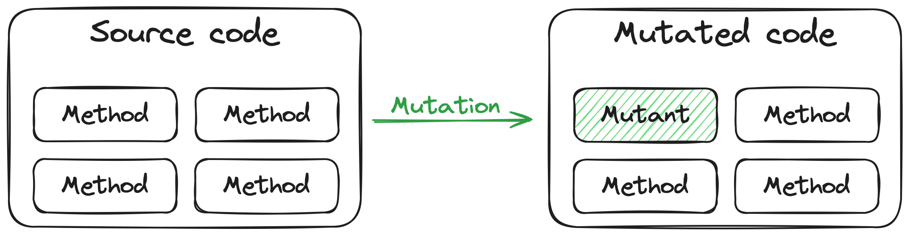
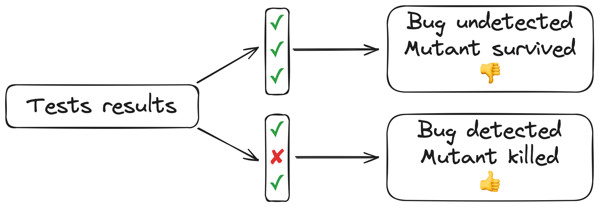
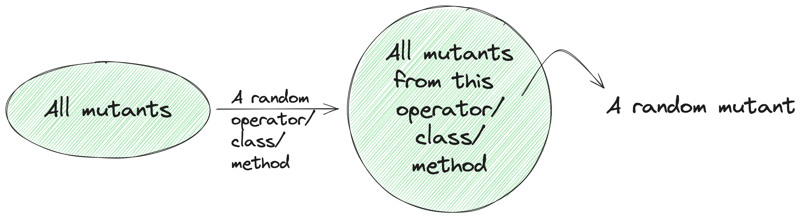
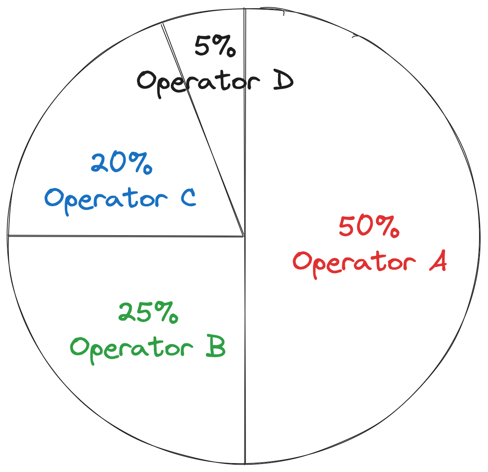
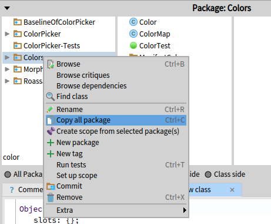
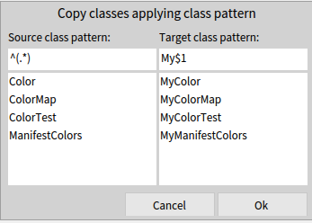
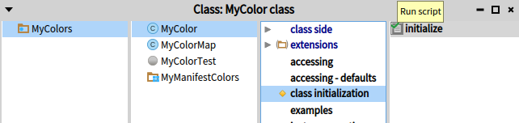
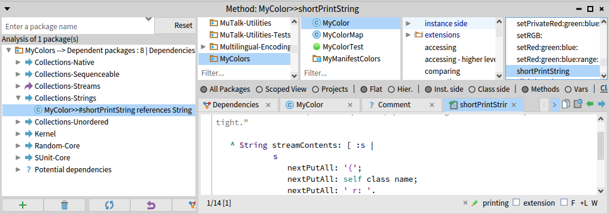

## MuTalk : A Mutation Testing Framework


_Authors:_ Iona Thomas -- Univ. Lille, Inria, CNRS, Centrale Lille, UMR 9189 CRIStAL, Lille, France -- iona.thomas@inria.fr and Pol Durieux -- Univ. Lille, Inria, CNRS, Centrale Lille, UMR 9189 CRIStAL, Lille, France -- pol.durieux@inria.fr

Mutation testing is a way of measuring the quality and completeness of a project's tests suite. While code coverage is used to make sure that tests execute each method or line of code, mutation testing evaluate the ability to detect new errors. It involves introducing errors and running the tests to see if they are detected. MuTalk is a flexible mutation framework providing good default values for analyzing a test suite. It can be customized to fit specific domains or projects.
Through this chapter we will discuss :
- 1. Introduction to Mutation Testing
- 2. How to use MuTalk / Quick Start
- 3. Available options in MuTalk
- 4. Mutation analysis : variants on mutation testing (TO CHECK)

### Introduction to Mutation Testing

#### Principles of Mutation Testing and Vocabulary

Mutation testing allows one to measure the quality and completeness of a project's tests suite. This is done by introducing errors, known as **mutations**, into the source code of a project, for example in a method. This modified method is called a **mutant**. The version of the code containing a mutant is called the **mutated code**. The idea behind mutations is to simulate real mistakes that developers can make.




Then the tests are run for each mutant to see if they are able to detect it. There are two possible scenarios:
* if the tests are green, the mutants have not been detected. They are said to have **survived**.
* if the tests are red, the mutants have been detected. They are said to have been **killed**.



A common observation when performing mutation testing on a project is that certain use cases have not been tested.


#### An example

Let's look at the following example method from the class `MyVehicle` :
```smalltalk
hasFourWheels:
^ self numberOfWheels = 4
```

Two different examples of mutations are changing the number of wheels and changing the comparison sign. This could result in the following mutants :

- Decreasing a "4" into a "3"
```smalltalk
"Mutant on the number of wheels"
hasFourWheels:
^ self numberOfWheels = 3
```

- Turning a "=" into a ">="
```smalltalk
"Mutant on comparison sign"
hasFourWheels:
^ self numberOfWheels >= 4
```

Let's imagine that we have only the following test :
```smalltalk
testHasFourWheels
 "Create a vehicule object with 4 wheels"
 | aVehicle |
 aVehicle := MyVehicle newWithWheels: 4.
 self assert: aVehicle hasFourWheels
```
Mutants are introduced one at a time. The mutant on the number of wheels will result in this test failing. This mutant has been killed.
The mutant on the comparison sign will pass the test. This mutant has survived.


#### The Mutation Score : a Test Suite Metric.

The ideal case for a test suite is to kill all mutants, as the tests are designed to detect errors in the code. If mutants survive, this means that if a real error is introduced into the project's source code during a development phase, it may not be detected before deployment and cause bugs later on.

The percentage of mutants killed is summarized with a mutation score, defined as:

$$ %label=mutationScore
Mutation\:score = \frac{Number\:of\:killed\:mutants}{Total\:number\:of\:mutants}
$$


### How to use MuTalk

MuTalk is Pharo's mutation testing library. It can be found on [GitHub](https://github.com/pharo-contributions/mutalk) {!footnote | https://github.com/pharo-contributions/mutalk !} and is loaded using Metacello (See Quick Start (*@quickStart@*) for code snippet). It allows you to perform mutation testing on a set of Pharo classes or on a set of packages.

#### The 4 steps of MuTalk Analysis

MuTalk mutation testing analysis works with two main elements: the source code to mutate and the tests that go with it.  
Once those are provided, the analysis then goes through 4 phases:
* [An initial test run](#Initial-test-run)
* [A coverage analysis](#Coverage-analysis)
* [The generation of mutants](#Mutant-generation)
* [The evaluation of mutants, also called the results generation](#Evaluation-of-mutants)  

##### Initial test run

The analysis will run every tests it was given. If a test fails, the analysis stops and inform the user that they should fix the tests. To avoid this, check the red tests filter (*@redTestFilter@*).

##### Coverage analysis

This phase is a regular coverage analysis used for test selection and mutant selection strategies. This allows the following analysis to be more efficient.

##### Mutant generation

Here the analysis creates the mutants of the source code using its mutant operators.

##### Evaluation of mutants

Finally, the analysis takes the mutants and apply them one by one. It installs a mutant and runs each selected test: this is the mutant evaluation. The evaluation stops at the first failing test or when every test has been run. Then the mutant is uninstalled, and it moves on to the next mutant.


#### Quick start
@quickStart

##### Loading MuTalk
Latest release (2.5.0):
```Smalltalk
Metacello new
  baseline: 'MuTalk';
  repository: 'github://pharo-contributions/mutalk:v2.5.0/src';
  load.
```
Latest version (unstable):
```Smalltalk
Metacello new
  baseline: 'MuTalk';
  repository: 'github://pharo-contributions/mutalk/src';
  load.
```

##### Running an analysis

To begin with, you need to create a mutation testing analysis with the *MTAnalysis* class:
```smalltalk
analysis := MTAnalysis new.
```

In order to function, MuTalk needs the classes or packages to be mutated, as well as the tests that go with them, because as said earlier, mutation testing's purpose is to test tests.  
To give a list of classes:
```smalltalk
analysis classesToMutate: { MyVehicle }.
analysis testClasses: { MyVehicleTest }.
```
or to give a list of packages:
```smalltalk
analysis packagesToMutate: { 'MuTalk-Examples' }.
analysis testPackages: { 'MuTalk-Examples-Tests' }.
```
MuTalk also has a number of configurable options, but these have default values. So you can run the analysis as it is and get the results:
```smalltalk
analysis run.
analysis generalResult inspect
```


### Analysis options in MuTalk
MuTalk offers several options for configuring the analysis and good default values. They allow to select which kind of mutation to apply, which methods to mutate, allocating budgets for the analysis, filtering the tests to use and logging. This sections goes into details about each of those options. If you are not interested in the details of these options, you can skip ahead to the next section on [exploring the results](#exploring-the-results)


#### Choosing the type of mutations

Mutation operators are objects that define a type of mutation and how to perform it. For example, there's a mutation operator that changes a `+` into a `-`. In MuTalk, they all have an *Operators* tag and are subclasses of `MTAbstractMutantOperator`. By default, they are all used, but if you want to use only some of them, proceed as follows *(don't forget to give actual instances of operators, not just the class)*:
```smalltalk
analysis operators: { MTRemoveCaretOperator new. MTReplaceDivisionWithMultiplicationMutantOperator new. MTReplaceIfFalseReceiverWithTrueOperator new }.
``` 

There are a lot of operators, available by default in MuTalk. The table below provides a list of what the current operators do. If these operators are not sufficient and/or if you require domains specific mutations, one can add operators by subclassing ```MTAbstractMutantOperator``` and adding them as operators to the analysis.

%TODO fix ?

| Category | Operators |
| -------- | --------- |
| Deletion | Empty method |
| | Remove `^` |
| | Remove exception handler |
| | Remove `inject:into:` |
| | Remove `not` |
| | Remove second block argument for `detect:ifNone:` |
| Arithmetic replacement | Replace `*` by `/` |
| | Replace `/` with `*` |
| | Replace `+` with `-` |
| | Replace `-` with `+` |
| Literal manipulation | Negate boolean |
| | Increase integer |
| | Decrease integer |
| | Integer to 0 |
| | String replacement |
| | Empty string |
| Logical boolean operation | Replace `and:` receiver with `true` |
| | Replace `or:` receiver with `false` |
| | Replace `and:` argument with `true` |
| | Replace `or:` argument with `false` |
| | Replace `obj and: block` with `false` |
| | Replace `obj or: block` with `true` |
| | Replace `and:` with `==`/`nand:`/`or:` |
| | Replace `or:` with `xor:`/`and:`|
| Conditional boolean operation | Replace `ifTrue:` receiver with `true`/`false` |
| | Replace `ifFalse:` receiver with `true`/`false` |
| | Replace `ifTrue:ifFalse:` receiver with `true`/`false` |
| | Replace `ifFalse:ifTrue:` receiver with `true`/`false` |
| | Replace `whileTrue:` receiver with `true`/`false` |
| | Replace `whileFalse:` receiver with `true`/`false` |
| | Replace `ifTrue:`/`ifFalse:` with `ifFalse:`/`ifTrue:` |
| | Replace `whileFalse:` with `whileTrue:` |
| | Replace `whileTrue:` with `whileFalse:` |
| Relational operation | Replace `=`/`~=` with `~=`/`=` |
| | Replace `(a == b)` with `(a == b) not` |
| | Replace `<`/`>` with `>`/`<` |
| | Replace `>=` with `=`/`>` |
| | Replace `<=` with `=`/`<`/`>`/`true` |
| | Replace `max:`/`min:` with `min:`/`max:` |
| Collection operation | Replace `isEmpty` with `notEmpty` |
| | Replace arg. for `sortBlock:` with always true block |
| | Replace arg. for `reject:` with always true/false block |
| | Replace arg. for `select:` with always true/false block |
| | Replace `select:`/`reject:` with `reject:`/`select:` |
| | Remove `at:ifAbsent:` |
| | Remove block argument for `do:` |
| | Replace 1st arg. for `detect:ifNone:` with always true/false block |
| | Replace 2nd arg. for `detect:ifNone:` with empty block |
| Message sender | Replace 1st/2nd/3rd argument of message send with `nil` |
| | Replace message send with `yourself` |
| Other | Replace assignment value with `nil` |
| | Replace class reference by references to its subclasses |

#### Selection of methods to be mutated

Mutant generation strategies are ways of choosing which methods will be mutated. Each strategy is implemented as a subclass of `MTMutantGenerationStrategy`. They are tagged *Mutant generation strategies* in the package `MuTalk-Model` and are used as follows:  
```smalltalk
analysis mutantGenerationStrategy: myMutantGenerationStrategy.
```
##### `MTAllMutantGenerationStrategy`  
The default strategy is to mutate all methods of the provided classes.
```smalltalk
myMutantGenerationStrategy := MTAllMutantGenerationStrategy new.
```

##### `MTSelectingFromCoverageMutantGenerationStrategy`  
Another strategy is to mutate only those methods that are covered by tests, again to save execution time.
```smalltalk
myMutantGenerationStrategy := MTSelectingFromCoverageMutantGenerationStrategy new.
```

##### `MTManualMutatedMethodGenerationStrategy`  
This strategy is based on manual selection of the methods to be mutated, i.e. providing the mutant selection strategy with a collection of methods. The mutations will then be applied to these methods and not to those given at analysis creation.  
To use this strategy:
```smalltalk
myMutantGenerationStrategy := MTManualMutatedMethodGenerationStrategy new targetMethods: { MyVehicle>>#numberOfWheels: . MyVehicle>>#hasFourWheels }.
```


#### Budgeted analysis
@budgets

Execution budgets define limits to the analysis, such as an execution time limit. In MuTalk, they have the tag *Budgets* and are used as follows:
```smalltalk
analysis budget: myBudget.
```

##### `MTTimeBudget`  
The default budget imposes a time limit on the analysis. After this time, the analysis ends.  
To use it, you need to give a time, for example:
```smalltalk
myBudget := MTTimeBudget for: 2 minutes.
```
##### `MTFreeBudget`  
This budget imposes no restrictions on analysis.
```smalltalk
myBudget := MTFreeBudget new.
```

##### `MTFixedNumberOfMutantsBudget` and `MTPercentageOfMutantsBudget`.  
These budgets impose a restriction on the number of mutants analyzed, respectively in absolute number of mutants or in percentage of mutants.  
To use them, you need to specify a number of mutants or a percentage, as follows:
```smalltalk
myBudget := MTFixedNumberOfMutantsBudget for: 100.
“or"
myBudget := MTPercentageOfMutantsBudget for: 50.
```

What is interesting to note is that it is not necessary to evaluate all mutants to have a general idea of the mutation score of some classes.

For example, this is a graph of mutation score as a function of the percentage of mutants evaluated.

For each percent, an analysis was run 10 times with a simple random mutant selection strategy, and the mutation score of each analysis was computed. Then a boxplot was drawn with those 10 scores. 

It shows that even though there is a greater variance the lower the percentage is, the median is still relatively close to the mutation score at 100%.

#### Selection of mutants to be evaluated for budgeted analysis

When running an analysis with a budget (*@budgets@*), not all mutants can be evaluated. In this context it is important to think about which mutants will be chosen for the analysis, and not to lose too much information. Even though there is no way to measure the value of a mutant in an analysis yet in MuTalk, a basic asumption is that it is important to have diversity.  
Mutant selection strategies define which mutants will be used for analysis, and in which order. They are attributes of mutant generation strategies. In MuTalk, they have the tag *Mutant selection strategies* and are used as follows:
```smalltalk
analysis mutantSelectionStrategy: myMutantSelectionStrategy.
```

##### `MTRandomClassMutantSelectionStrategy`, `MTRandomMethodMutantSelectionStrategy` and `MTRandomOperatorMutantSelectionStrategy`  
These strategies shuffle mutants randomly, but in a particular way. They respectively randomly select a class, method or mutation operator, then select a mutant from that class, method or operator. Operator selection is MuTalk's default strategy.  
These strategies are particularly useful when reducing the number of mutants analyzed with budgets (*@budgets@*). They enable classes/methods/operators that produce few mutants to still be represented in the final results when the number of mutants decreases.
```smalltalk
myMutantSelectionStrategy := MTRandomClassMutantSelectionStrategy new.
“or"
myMutantSelectionStrategy := MTRandomMethodMutantSelectionStrategy new.
"or"
myMutantSelectionStrategy := MTRandomOperatorMutantSelectionStrategy new.
```



Let's say there are four operators: A, B, C and D, and they each produce some mutants. A produces half of the total mutants, D produces very few of them, while B and C produce the rest. For the purpose of the example we will consider that all the operators still generate a lot of mutants, just that the representation in the total number of generated mutants are different.  
With a mutant selection that chooses randomly and without any bias a mutant for the analysis, the final selection would look like this:
  
Here, A is overrepresented in the final results, while D is barely present. However an operator is not necessary less meaningful in the analysis because 


In this example, a random operator selection strategy ensures that operator D is almost certainly represented in the results, which is not guaranteed with conventional random selection. 

##### `MTRandomMutantSelectionStrategy`  
This strategy is to shuffle all mutants randomly and indiscriminately.
```smalltalk
myMutantSelectionStrategy := MTRandomMutantSelectionStrategy new.
```

##### `MTMutantSelectionStrategy`  
This strategy consists simply in not mixing the list of mutants and returning it as it is. This should NOT be used with a budgeted analysis as it would result in a very biased selection.
```smalltalk
myMutantSelectionStrategy := MTMutantSelectionStrategy new.
```


#### General test filters
@testFilters

Test filters allow you to block certain tests for the whole analysis according to certain criteria. These blocked tests will then not be executed during mutant evaluation. Filters are tagged *Test filters* in MuTalk and are used as follows:
```smalltalk
analysis testFilter: myTestFilter.
```

##### `MTCompositeTestFilter`  
This is the default test filter used by the analysis, used with a red test filter and a time test filter.
This test filter works as a combination of multiple test filters. It has a collection of test filters as an attribute, and the test collection passes through each filter. A test is blocked by the composite if any of its filters blocks the test, and it passes through the composite if it passes through all its filters.  
To use it:
```smalltalk
myTestFilter := MTCompositeTestFilter for: { MTRedTestFilter new . MTTimeTestFilter for: 2 seconds }.
```

##### `MTFreeTestFilter`  
This filter lets everything through.
```smalltalk
myTestFilter := MTFreeTestFilter new.
```

##### `MTBlockTestFilter`  
This filter only lets through tests that respect the condition of the block it receives.  
It is used in this way, for example:
```smalltalk
myTestFilter := MTBlockTestFilter for: [ :testCase | testCase selector endsWith: 'test' ].
```

##### `MTPragmaSelectionTestFilter`  
This filter uses Pharo's pragmas as a condition for filtering tests. It only keeps tests that contain a given pragma.  
To use this filter:
```smalltalk
myTestFilter := MTPragmaSelectionTestFilter for: #aPragma.
```

##### `MTPragmaRejectionTestFilter`  
This filter works similarly to the previous one, but instead it blocks tests that contain the given pragma.  
To use it:
```smalltalk
myTestFilter := MTPragmaRejectionTestFilter for: #aPragma.
```

##### `MTRedTestFilter`
@redTestFilter

This filter blocks tests that fail, i.e. that are red. For MuTalk it's important that the tests are all green before applying the mutations, because when it evaluates the mutants it's the red tests that will tell whether they're killed or not, hence the usefulness of this filter.
```smalltalk
myTestFilter := MTRedTestFilter new.
```


##### `MTTimeTestFilter`  
This filter blocks tests that take longer than a given time to run. If the duration is well chosen, it can eliminate tests that are too time-consuming.  
This is how it is used:
```smalltalk
myTestFilter := MTTimeTestFilter for: 2 seconds.
```


#### Per mutant test selection

Test selection strategies are ways of choosing which tests will be run for each mutant evaluation. In MuTalk, they have the tag *Test selection strategies* and are used as follows:
```smalltalk
analysis testSelectionStrategy: myTestSelectionStrategy.
```
##### `MTSelectingFromCoverageTestSelectionStrategy`  
The default is to select only those tests that cover mutants, to speed up analysis. In other words when evaluating a mutant, if a test does not use the mutated method, it will not be run for this evaluation.
```smalltalk
myTestSelectionStrategy := MTSelectingFromCoverageTestSelectionStrategy new.
```

##### `MTAllTestsMethodsRunningTestSelectionStrategy`  
Another more basic strategy is to run all tests all the time, but this is more time-consuming.
```smalltalk
myTestSelectionStrategy := MTAllTestsMethodsRunningTestSelectionStrategy new.
```

#### Loggers

Loggers provide traces of analysis execution. Depending on the logger used, this trace will be visible in different places. In MuTalk, they have the *Logging* tag and are used as follows:
```smalltalk
analysis logger: myLogger.
```

##### `MTProgressBarLogger`  
This logger is selected by default for analysis. It uses a progress bar to display the progress of the analysis in real time.
```smalltalk
myLogger := MTProgressBarLogger new.
```

##### `MTNullLogger`  
This logger logs nothing.
```smalltalk
myLogger := MTNullLogger new.
```

##### `MTFileLogger`  
This logger writes the trace to a file whose name must be given. The logger will create the file.  
To use it:
```smalltalk
myLogger := MTFileLogger toFileNamed: 'log.txt'.
```

##### `MTTranscriptLogger`  
This logger writes the trace in the Pharo's Transcript.
```smalltalk
myLogger := MTTranscriptLogger new.
```


### Handling core classes

Mutation testing requires modifying the classes under analysis. This is fine when we are studying an application with its own specific classes. However, once we want to analyse classes that are part of the core of the Pharo system, it gets more complicated. Imagine introducing a bug into the UI of all windows with a mutation. Or into the definition of `Object` or `Class`. Those mutations can crash your Pharo instance.

One solution to be able to run mutation testing on such classes is to create a copy of those classes and their tests. This copy can be mutated without it impacting the stability of  the system. Pharo comes with a tools to help you copy package and identify dependencies : package duplication with regex for replacing class names and the `Dependencies browser`. The package duplication modify the classes in the copy to reference each other instead of referencing the original package. The dependencies browser allows one to check what are the remaining dependencies after the duplication.

Let's take the exemple of `Color`, which is used for all the UI. For this example we will temporarily move the test class of `Color` into the `Colors` package. With them together, we can duplicate both at the same time, allowing the duplication to rewrite referenences to `Color` into the tests to `MyColor`, the duplicated version.



Using a regular expression, we copy all classes and we prefix their duplicated name with `My` to differentiate them. 



Once the classes are duplicated, the `MyColor` class needs to be initialized. Once this is done, the 16 tests of `MyColorTest` are green. 



At this point, we can check that we have no remaining dependencies to the original `Colors` package by right clicking the package name and chosing `Browse dependencies`. We can check in the picture below that in the left most column we do not see the `Colors` package. 



We can now run a mutation analysis on our duplicated version of `Colors`:

```Smalltalk
analysis := MTAnalysis new.
analysis classesToMutate: { MyColor }.
analysis testClasses: { MyColorTest }.
analysis run.
analysis generalResult inspect
```
TODO test code above with latest version


However even those tools have some limits. For example implicit references such as pseudo variable or creating objects with literals won't be caught. For example, most tests for booleans use the `true` and `false` pseudo variables. These make the reference to the Boolean class implicit, and it won't be rewritten to point to the new class boolean class when duplicating those. Using a literal notation in tests such as `#( 1 2 7)` won't be rewritten when trying to duplicate `Array` for mutation testing. Finally some syntactic sugar such as sending a message to a first class to create an instance of a second one also blinds the rewritting during duplication. When duplicating `Point` and its tests, test using the `@` message to create points (ex: 1@6 creates a point where x is 1 and y is 6) are not rewritten.

Studying such core classes requires more work to create an accurate copy before running the mutation analysis on it.


### Exploring the results

Once an analysis is run, we obtain a `MTGeneralResult` objects which comes with its specific inspector pannels. MuTalk also includes tools which use the results of a mutation testing analysis to extract data.
In this section we go over how to understand the results of the analysis.

#### Example of Analysis

Here is an example of mutation testing analysis with provided example classes. Let's look at the results.
```smalltalk
analysis := MTAnalysis new
	            classesToMutate: { MyVehicle };
	            testClasses: { MyVehicleTest }.
"parametrization goes here"
analysis run.
analysis generalResult inspect
```

#### The result object


This is the inspector on the result object of the analysis. From top to bottom :
* The numbers of mutants evaluated, killed, surviving and terminated are displayed at the top of the window.
* The inspector contains 4 more tabs than the usual inspector that are specific to the mutation analysis:
    - The `Surviving Mutants` tab lists all the mutants that survived.
    - The `Killed Mutants` tab lists all the mutants that were killed.
    - The `Terminated Mutants` tab lists the mutants for which there was an issue while performing the installation or uninstallation during the evaluation.
    - The `Excluded Tests` tab lists the tests that were rejected by the test filter (*@testFilters@*) and why they were rejected.
* For the mutants tabs, the inspector displays a list of mutants with their names. This includes the type of mutation applied, and the mutated class and method (Ex: `Increase a literal integer in MyVehicle class>>#newSimpleCar`). When clicking on a mutant, it shows below the code of the original method on the left and the mutated code on the right. Differences are highlighted in green and red. On the image below, we can see that a number was decreased by the mutation from 4 to 3.

By looking at the first tab on surviving mutants, one can see which cases should be targeted by new tests to improve the tests suite.


#### Mutation matrix: a visual representation

The mutation matrix is a matrix representing the results of mutant tests. It shows exactly which test killed which mutant. This can be useful for further analysis of the test suite.

There are several ways to use it:
* with a collection of classes, assuming the associated test classes have the same names with the suffix “Test”:
    ```smalltalk
    matrix := MTMatrix forClasses: { MyVehicle }
    ```
* with a collection of classes and a collection of test classes:
    ```smalltalk
    matrix := MTMatrix forClasses: { MyVehicle } andTests: { MyVehicleTest }
    ```
* with a collection of packages, assuming that the associated test packages have the same names with the suffix “-Tests”:
    ```smalltalk
    matrix := MTMatrix forPackages: { 'MuTalk-Examples' }
    ```
* with a collection of packages and a collection of test packages:
    ```smalltalk
    matrix := MTMatrix forPackages: { 'MuTalk-Examples' } andTestPackages: { 'MuTalk-Examples-Tests' }
    ```

Once created, the matrix must be constructed with `build` to ran the corresponding mutation analysis. Then it can be displayed with `generateMatrix`. Here is the snippet to analyse `MyVehicle` example class :

```smalltalk
matrix := MTMatrix forClasses: { MyVehicle }.
matrix build.
matrix generateMatrix.
```
Here is the first few lines of a matrix built from the analysis of `MyVehicle`:


The rows are the mutants, and the columns the tests. A blue box means the mutant is killed by the test.
In this matrix, the mutation that increased a literal integer in MyVehicle>>#hasFourWheels has been killed by both #testHasFourWheels and #testSimpleCarHasFourWheels. 


A heatmap can also be generated. It groups tests by class and mutants by mutation operators, class, method, or any other grouping condition given as a block, to better summarise the data.  
The heatmap can be displayed as follows, when mutants are grouped by method:
```smalltalk
matrix generateHeatmapByMethod
```

This is the heatmap built also on `MyVehicle` that groups mutants by mutation operators:
  
Here the number in each cell is the percentage of tests in the test class that killed the mutants of each type of operators used in the analysis.


It is now possible to obtain several pieces of information:

##### Trivial mutants
Trivial mutants are mutants killed by all tests:
```smalltalk
matrix trivialMutants inspect
```
Since these mutants are killed by all tests, we can assume that the real errors they represent will always be detected in real-life situations. This means that these mutants may not be necessary for the data provided.

##### Equivalent mutants
Equivalent mutants are mutants that are killed by the same tests:
```smalltalk
matrix equivalentMutants inspect
```
This gives several groups of mutants, each containing mutants that are equivalent to each other.  
If 2 mutants are equivalent, this may mean that, from the point of view of the tests, they are redundant. In other words, they have the same “profile” with regard to the tests, so one of them can be eliminated.

##### Included mutants
A mutant A is included in a mutant B if it is killed by a subset of the test set that kills B. In other words, if B is killed by tests 1, 2 and 3, and A is killed by tests 1 and 3, then A is included in B. To get them:
```smalltalk
matrix includedMutants inspect
```
A dictionary is returned where the keys are each mutant and the values are the mutants included in the key mutant.  
If one mutant is included in another, we can also say here that there is redundancy and that it's better to keep the “bigger” mutant (in the sense of “killed by a greater number of tests”).

#### Mutation operator analysis 

Mutation operator analysis is used to find out how many mutants the Mutalk mutation operator set produces on given classes or packages. In other words, you can find out which operators produce at least a certain number of mutants, and which produce at most a certain number of mutants.  
To use it:
```smalltalk
operatorAnalysis := MTMutantOperatorAnalysis forClasses: { MyVehicle }
```
or:
```smalltalk
operatorAnalysis := MTMutantOperatorAnalysis forPackages: { 'MuTalk-Examples' }
```
and then:
```smalltalk
operatorAnalysis operatorsProducingAtMost: 2
```
and:
```smalltalk
operatorAnalysis operatorsProducingAtLeast: 10
```


#### Non-mutated methods

The analysis of non-mutated methods allows you to find methods on which MuTalk has been unable to apply mutations, i.e. methods whose body contains no code corresponding to the application domains of the mutation operators.  
This analysis also applies to classes or packages:
```smalltalk
analysis := MTNonMutatedMethodsAnalysis forClasses: { MyVehicle }
```
or:
```smalltalk
analysis := MTNonMutatedMethodsAnalysis forPackages: { 'MuTalk-Examples' }
```
Finally, to have the methods without mutation:
```smalltalk
analysis methodsWithoutMutation inspect
```

### Conclusion

In this chapter we presented Mutalk, a mutation analysis framework. We explained the principle of mutation testing and its original goal, evaluating a test suite. We provided examples and documentation on how to run such an analysis and how to parameterize it. We presented the default mutations and the way one can optimize its run time with budgets, especially for use cases such as continuous integration.

However, the use of this framework is not limited to mutation testing. Mutation analysis is using the mutation testing principle of modifying the code a little, running the tests and collecting the results. However mutation analysis can study other topic than the quality of the test suite. Assuming the test suite is good enough, one can use mutation analysis and custom mutation to study the use of reflection (TODO) or to test a refactoring framework for example (TODO)).


