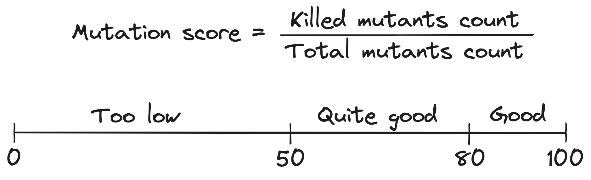
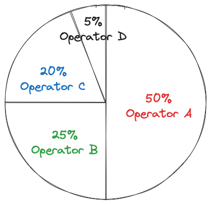

## MuTalk : A Mutation Testing Framework


_Authors:_ Prof. T. Tournesol -- Moulinsart Lab, Belgium -- tryphon.tournesol@moulinsart.be and Prof. H. Ochanomizu -- AstroLabs, Japan -- hiro.ochanomizu@astroLabs.jp %TODO

Mutation testing is a way of measuring the quality and completeness of a project's tests suite. While code coverage is used to make sure that tests execute each method or line of code, mutation testing evaluate the ability to detect new errors. It involves introducing errors and running the tests to see if they are detected. MuTalk is a flexible mutation framework providing good default values for analyzing a test suite. It can be customized to fit specific domains or projects.
Through this chapter we will discuss :
- 1. Introduction to Mutation Testing
- 2. How to use MuTalk / Quick Start
- 3. Available options in MuTalk
- 4. Mutation analysis : variants on mutation testing

### 1. Introduction to Mutation Testing

#### Principles of Mutation Testing and Vocabulary

Mutation testing allows one to measure the quality and completeness of a project's tests suite. This is done by introducing errors, known as **mutations**, into the source code of a project, for example in a method. This modified method is called a **mutant**. The version of the code containing a mutant is called the **mutated code** The idea behind mutations is to simulate real mistakes that developers can make.


Then the tests are run for each mutant to see if they are able to detect it. There are two possible scenarios:
* if the tests are green, the mutants have not been detected. They are said to have **survived**.
* if the tests are red, the mutants have been detected. They are said to have been **killed**.


A common observation when performing mutation testing on a project is that certain use cases have not been tested.


#### an Example

Let's look at the following example method :
```smalltalk
hasFourWheels: aVehicle
^ (aVehicle numberOfWheels = 4)
```

Two examples of mutations are changing the number of wheel and changing the comparison sign. This could result in the following mutants :

- Decreasing a "4" into a "3"
```smalltalk
"Mutant on the number of wheels"
hasFourWheels: aVehicle
^ (aVehicle numberOfWheels = 3)
```

- Turning a "=" into a ">="
```smalltalk
"Mutant on comparison sign"
hasFourWheels: aVehicle
^ (aVehicle numberOfWheels >= 4)
```

Let's imagine that we have only the following test :
```smalltalk
testHasFourWheels
 "Create a vehicule object with 4 wheels"
 car = aVehicule newWithWheels: 4
 self assert: car hasFourWheels.
```

The mutant on the number of wheels will result in this test failing. This mutant has been killed.
The mutant on the comparison sign will pass the test. This mutant has survived.


#### The Mutation Score : a Test Suite Metric.

The ideal case for a test suite is to kill all mutants, as the tests are designed to detect errors in the code. If mutants are not killed, this means that if a real error is introduced into the project's source code during a development phase, it may not be detected before deployment and cause bugs later on.

The number of mutants killed is summarized with a mutation score. This score is defined as the ratio between the number of mutants killed and the total number of mutants. A score above **50%** is considered correct, and above **80%** good. %TODO:source




### 2. How to use MuTalk

MuTalk is Pharo's mutation testing library. It can be found on [GitHub](https://github.com/pharo-contributions/mutalk) {!footnote|note=[](https://github.com/pharo-contributions/mutalk)} and is loaded using Metacello (See (Quick Start)[#quick-start] for code snippet). It allows you to perform mutation testing on a set of Pharo classes or on a set of packages.

#### The 4 steps of MuTalk Analysis

The mutation testing analysis of MuTalk works with two main elements: the source code to mutate and the tests that go with it.  
With those, the analysis then goes through 4 phases:
* [An initial test run](#Initial-test-run)
* [A coverage analysis](#Coverage-analysis)
* [The generation of mutants](#Mutant-generation)
* [The evaluation of mutants, also called the results generation](#Evaluation-of-mutants)  

##### Initial test run

During this phase, the analysis will run every tests it was given. If a test fails, the analysis stops and inform the user that they should fix the tests. To avoid this, check the [red test filter](*@redTestFilters@*).%TODO

##### Coverage analysis

This phase is a regular coverage analysis used for test selection and mutant selection strategies. This allows the following analysis to be more efficient.

##### Mutant generation

During this phase, the analysis creates the mutants of the source code using its mutant operators.
##### Evaluation of mutants

In this phase, the analysis takes the mutants and apply them one by one, one at a time. It installs a mutant and runs each selected test: this is the mutant evaluation. The evaluation stops at the first failing test or when every test has been run. Then the mutant is uninstalled, and it moves on to the next mutant.


#### Quick start

##### Loading MuTalk
Latest release (2.5.0):
```Smalltalk
Metacello new
  baseline: 'MuTalk';
  repository: 'github://pharo-contributions/mutalk:v2.5.0/src';
  load.
```
Latest version (unstable):
```Smalltalk
Metacello new
  baseline: 'MuTalk';
  repository: 'github://pharo-contributions/mutalk/src';
  load.
```

##### Running an analysis

To begin with, you need to create a mutation testing analysis with the *MTAnalysis* class:
```smalltalk
analysis := MTAnalysis new.
```

In order to function, MuTalk needs the classes or packages to be mutated, as well as the tests that go with them, because as said earlier, mutation testing's purpose is to test tests.  
To give a list of classes:
```smalltalk
analysis classesToMutate: { MyClass1 . MyClass2 }.
analysis testClasses: { MyTestClass1 . MyTestClass2 }.
```
or to give a list of packages:
```smalltalk
analysis packagesToMutate: { MyPackage1 . MyPackage2 }.
analysis testPackages: { MyTestPackage1 . MyTestPackage2 }.
```
MuTalk also has a number of configurable options, but these have default values. So you can run the analysis as it is and get the results:
```smalltalk
analysis run.
analysis generalResult inspect
```

#### Example of Analysis

TODO, UUID example


### 3. Exploring the results


MuTalk also includes tools which use the results of a mutation testing analysis to extract data.

#### The result object
%TODO: structure de l'object + screenshot inspecteur


#### Mutation matrix: a visual representation

The mutation matrix is a matrix representing the results of mutant tests. It shows which test killed which mutant.    
There are several ways to use it:
* with a class, assuming the associated test class has the same name with the suffix “Test”:
    ```smalltalk
    matrix := MTMatrix forAClass: AClass
    ```
* with a collection of classes and a collection of test classes:
    ```smalltalk
    matrix := MTMatrix forClasses: { AClass1 . AClass2 } andTests: { ATestClass1 . ATestClass2 . ATestClass3 }
    ```
* with a package, assuming that the associated test package has the same name with the suffix “-Tests”:
    ```smalltalk
    matrix := MTMatrix forAPackage: 'APackage'
    ```
* with a package and a test package:
    ```smalltalk
    matrix := MTMatrix forAPackage: 'APackage' andTestPackage: 'APackage-Tests'
    ```

Once created, the matrix must be constructed:
```smalltalk
matrix build
```  
To build itself, the matrix ran a mutation testing analysis with the data provided.  
The matrix can be displayed as follows:
```smalltalk
matrix generateMatrix
```

%TODO matrix on UUID

It is now possible to obtain several pieces of information:

##### Trivial mutants
Trivial mutants are mutants killed by all tests:
```smalltalk
matrix trivialMutants inspect
```
Since these mutants are killed by all tests, we can assume that the real errors they represent will always be detected in real-life situations. This means that these mutants may not be necessary for the data provided.

##### Equivalent mutants
Equivalent mutants are mutants that are killed by the same tests:
```smalltalk
matrix equivalentMutants inspect
```
This gives several groups of mutants, each containing mutants that are equivalent to each other.  
If 2 mutants are equivalent, this may mean that, from the point of view of the tests, they are redundant. In other words, they have the same “profile” with regard to the tests, so one of them can be eliminated.

##### Included mutants
A mutant A is included in a mutant B if it is killed by a subset of the test set that kills B. In other words, if B is killed by tests 1, 2 and 3, and A is killed by tests 1 and 3, then A is included in B. To get them:
```smalltalk
matrix includedMutants inspect
```
A dictionary is returned where the keys are each mutant and the values are the mutants included in the key mutant.  
If one mutant is included in another, we can also say here that there is redundancy and that it's better to keep the “bigger” mutant (in the sense of “killed by a greater number of tests”).

#### Mutation operator analysis 

Mutation operator analysis is used to find out how many mutants the Mutalk mutation operator set produces on given classes or packages. In other words, you can find out which operators produce at least a certain number of mutants, and which produce at most a certain number of mutants.  
To use it:
```smalltalk
operatorAnalysis := MTMutantOperatorAnalysis forClasses: { MyClass1 . MyClass2 }
```
or
```smalltalk
operatorAnalysis := MTMutantOperatorAnalysis forPackages: { 'MyPackage1' . MyPackage2 }
```
and then:
```smalltalk
operatorAnalysis operatorsProducingAtMost: 2
```
and:
```smalltalk
operatorAnalysis operatorsProducingAtLeast: 10
```

#### Non-mutated methods

The analysis of non-mutated methods allows you to find methods on which MuTalk has been unable to apply mutations, i.e. methods whose body contains no code corresponding to the application domains of the mutation operators.  
This analysis also applies to classes or packages:
```smalltalk
analysis := MTNonMutatedMethodsAnalysis forClasses: { MyClass1 . MyClass2 }
```
or
```smalltalk
analysis := MTNonMutatedMethodsAnalysis forPackages: { 'MyPackage1' . MyPackage2 }
```
Finally, to have the methods without mutation:
```smalltalk
analysis findMethodsWithoutMutation inspect
```


### 4. The different options in MuTalk
MuTalk offers several options for configuring the analysis.  
**Note:** In the following, if nothing is specified regarding the use of the objects mentioned, simply create the object with `new`. If you need to specify an additional parameter when creating the object, this will be indicated.

#### Choosing the type of mutations

Mutation operators are objects that define a type of mutation and how to perform it. For example, there's a mutation operator that changes a `+` into a `-`. In MuTalk, they all have an *Operators* tag and are subclasses of `MTAbstractMutantOperator`. By default, they are all used, but if you want to use only some of them, proceed as follows:
```smalltalk
analysis operators: { operator1 . operator2 . operator3 }
```

Operators are objects that describe a type of mutation. They're like a guideline on how to perform the mutation they correspond to.
There are two ways to tell the analysis which operators you want to use:
* `MTAbstractMutantOperator contents` that returns all operators minus a few ones that are implemented a bit differently that the others %TODO
* `MTAbstractMutantOperator contentsAll` that returns the whole set of operators and that is used by default for analysis  

There are a lot of operators, available by default in MuTalk. *@tabAllOperators@* provides a list. If these operators are not sufficient and/or if you require domains specific mutations, one can add operators by subclassing ```MTAbstractMutantOperator``` and adding them as operators to the analysis.


%TODO fix ?
@tabAllOperators
|       Category                | Operators |        |
|         --                    |     --    |     --    |
| Deletion                      | Empty method |
|                               | Remove `^` |
|                               | Remove exception handler |
|                               | Remove `inject:into:` |
|                               | Remove `not` |
|                               | Remove second block argument for `detect:ifNone:` |
|         --                    |     --    |     --    |
| Arithmetic                    | Replace `*` by `/` |
|   replacement                 | Replace `/` with `*` | 
|                               | Replace `+` with `-` |
|                               | Replace `-` with `+` |
|         --                    |     --    |     --    |
| Literal                       | Negate boolean |
| manipulation                  | Increase integer |
|                               | Decrease integer |
|                               |  Integer to 0 |
|                               | String replacement |
|                               | Empty string |
|         --                    |     --    |     --    |
| Logical                       | Replace `and:` receiver with `true` |
|  boolean                      | Replace `or:` receiver with `false` |
|  operation                    | Replace `and:` argument with `true` |
|                               | Replace `or:` argument with `false` |
|                               | Replace `obj and: block` with `false` |
|                               | Replace `obj or: block` with `true`|
|                               | Replace `and:` with `==`/`nand:`/`or:` |
|                               | Replace `or:` with `xor:`/`and:`|
|         --                    |     --    |     --    |
| Conditional                   | Replace `ifTrue:` receiver with `true`/`false` |
| boolean                       | Replace `ifFalse:` receiver with `true`/`false` |
| operation                     | Replace `ifTrue:ifFalse:` receiver with `true`/`false` |
|                               | Replace `ifFalse:ifTrue:` receiver with `true`/`false`|
|                               | Replace `whileTrue:` receiver with `true`/`false` |
|                               | Replace `whileFalse:` receiver with `true`/`false`|
|                               | Replace `ifTrue:`/`ifFalse:` with `ifFalse:`/`ifTrue:` |
|                               | Replace `whileFalse:` with `whileTrue:` |
|                               | Replace `whileTrue:` with `whileFalse:` |
|         --                    |     --    |     --    |
| Relational                    | Replace `=`/`~=` with `~=`/`=` |
|    operation                  | Replace `(a == b)` with `(a == b) not`|
|                               | Replace `<`/`>` with `>`/`<` |
|                               | Replace `>=` with `=`/`>` |
|                               | Replace `<=` with `=`/`<`/`>`/`true` |
|                               | Replace `max:`/`min:` with `min:`/`max:` |
|         --                    |     --    |     --    |
| Collection                    | Replace `isEmpty` with `notEmpty` |
|   operation                   | Replace arg. for `sortBlock:` with always true block |
|                               | Replace arg. for `reject:` with always true/false block |
|                               | Replace arg. for `select:` with always true/false block|
|                               | Replace `select:`/`reject:` with `reject:`/`select:` |
|                               | Remove `at:ifAbsent:` |
|                               | Remove block argument for `do:`|
|                               | Replace 1st arg. for `detect:ifNone:` with always true/false block |
|                               | Replace 2nd arg. for `detect:ifNone:` with empty block |
|         --                    |     --    |     --    |
| Message                       | Replace 1st/2nd/3rd argument of message send with `nil`|
|  sender                       | Replace message send with `yourself` |
|         --                    |     --    |     --    |
| Other                         | Replace assignment value with `nil` |
|                               | Replace class reference by references to its subclasses |

#### Mutant generation strategies

Mutant generation strategies are ways of choosing which methods will be mutated. They are tagged *Mutant generation strategies* in MuTalk and are used as follows:
```smalltalk
analysis mutantGenerationStrategy: myMutantGenerationStrategy
```
* `MTAllMutantGenerationStrategy`  
The default strategy is to mutate all methods of the provided classes.

* `MTSelectingFromCoverageMutantGenerationStrategy`  
Another strategy is to mutate only those methods that are covered by tests, again to save execution time.

* `MTManualMutatedMethodGenerationStrategy`  
This strategy is based on manual selection of the methods to be mutated, i.e. providing the mutant selection strategy with a collection of methods. The mutations will then be applied to these methods and not to those given at analysis creation.  
To use this strategy:
    ```smalltalk
    myMutantGenerationStrategy := MTManualMutatedMethodGenerationStrategy new targetMethods: { method1 . method2 }
    ```


#### Budgeted analysis

Execution budgets define limits to the analysis, such as an execution time limit. In MuTalk, they have the tag *Budgets* and are used as follows:
```smalltalk
analysis budget: myBudget
```

* `MTTimeBudget`  
The default budget imposes a time limit on the analysis. After this time, the analysis ends.  
To use it, you need to give a time, for example:
    ```smalltalk
    myBudget := MTTimeBudget for: 2 minutes
    ```
* `MTFreeBudget`  
This budget imposes no restrictions on analysis.

* `MTFixedNumberOfMutantsBudget` and `MTPercentageOfMutantsBudget`.  
These budgets impose a restriction on the number of mutants analyzed, respectively in absolute number of mutants or in percentage of mutants.  
To use them, you need to specify a number of mutants or a percentage, as follows:
    ```smalltalk
    myBudget := MTFixedNumberOfMutantsBudget for: 100
    “or
    myBudget := MTPercentageOfMutantsBudget for: 50
    ```

#### Mutant selection strategies for budgeted analysis

When running [an analysis with a budget](#execution-budgets), not all mutants can be evaluated. Mutant selection strategies define which mutants will be used for analysis, and in which order. They are attributes of mutant generation strategies. In MuTalk, they have the tag *Mutant selection strategies* and are used as follows:
```smalltalk
analysis mutantGenerationStrategy mutantSelectionStrategy: myMutantSelectionStrategy
```
* `MTRandomMutantSelectionStrategy`  
The default strategy is to shuffle all mutants randomly and indiscriminately.


* `MTRandomClassMutantSelectionStrategy`, `MTRandomMethodMutantSelectionStrategy` and `MTRandomOperatorMutantSelectionStrategy`.  
These strategies also mix mutants randomly, but in a particular way. They respectively randomly select a class, method or mutation operator, then select a mutant from that class, method or operator. Operator selection is MuTalk's default strategy.  
These strategies are particularly useful when reducing the number of mutants analyzed with budgets (see below %TODO link). They enable classes/methods/operators that produce few mutants to still be represented in the final results when the number of mutants decreases.




In this example, a random operator selection strategy ensures that operator D is almost certainly represented in the results, which is not guaranteed with conventional random selection. 

* `MTMutantSelectionStrategy`  
This strategy consists simply in not mixing the list of mutants and returning it as it is. This should NOT be used with a budgeted analysis as it would result in a very biased selection.


#### General test filters


Test filters allow you to block certain tests according to certain criteria. These blocked tests will then not be executed during mutant evaluation. Filters are tagged *Test filters* in MuTalk and are used as follows:
```smalltalk
analysis testFilter: myTestFilter
```

* `MTFreeTestFilter`  
This filter lets everything through.

* `MTBlockTestFilter`  
This filter only lets through tests that respect the condition of the block it receives.  
It is used in this way, for example:
    ```smalltalk
    myTestFilter := MTBlockTestFilter for: [ :testCase | testCase selector endsWith: 'test' ]
    ```

* `MTPragmaSelectionTestFilter`  
This filter uses Pharo's pragmas as a condition for filtering tests. It only keeps tests that contain a given pragma.  
To use this filter:
    ```smalltalk
    myTestFilter := MTPragmaSelectionTestFilter for: aPragma
    ```

* `MTPragmaRejectionTestFilter`  
This filter works similarly to the previous one, but instead it blocks tests that contain the given pragma.  
To use it:
    ```smalltalk
    myTestFilter := MTPragmaRejectionTestFilter for: aPragma
    ```

* `MTRedTestFilter`  @redTestFilters
This filter blocks tests that fail, i.e. that are red. For MuTalk it's important that the tests are all green before applying the mutations, because when it evaluates the mutants it's the red tests that will tell whether they're killed or not, hence the usefulness of this filter.  

* `MTTimeTestFilter`  
This filter blocks tests that take longer than a given time to run. If the duration is well chosen, it can eliminate tests that are too time-consuming.  
This is how it is used:
    ```smalltalk
    myTestFilter := MTTimeTestFilter for: 2 seconds
    ```

* `MTCompositeTestFilter`  
This last filter allows you to combine several filters in series.  
To use it:
    ```smalltalk
    myTestFilter := MTCompositeTestFilter for: { testFilter1 . testFilter2 }
    ```

#### Per mutant test selection

Test selection strategies are ways of choosing which tests will be run during analysis. In MuTalk, they have the tag *Test selection strategies* and are used as follows:
```smalltalk
analysis mutantGenerationStrategy: myTestSelectionStrategy
```
* `MTSelectingFromCoverageTestSelectionStrategy`  
The default is to select only those tests that cover mutants, to speed up analysis. In other words, if a test does not use the mutated method, it will not be run.

* `MTAllTestsMethodsRunningTestSelectionStrategy`  
Another more basic strategy is to run all tests all the time, but this is more time-consuming.


#### Loggers

Loggers provide traces of analysis execution. Depending on the logger used, this trace will be visible in different places. In MuTalk, they have the *Logging* tag and are used as follows:
```smalltalk
analysis logger: myLogger
```

* `MTNullLogger`  
This logger logs nothing.

* `MTFileLogger`  
This logger writes the trace to a file whose name must be given. The logger will create the file.  
To use it:
    ```smalltalk
    myLogger := MTFileLogger toFileNamed: 'log.txt
    ```

* `MTTranscriptLogger`  
This logger writes the trace to Pharo's Transcript.

* `MTProgressBarLogger`  
This logger is selected by default for analysis. It uses a progress bar to display the progress of the analysis in real time.

=======

### 5. Specific cases

#### UUID : A singleton case, or How to add tear down during the analysis

#### Handling core classes 


### 6. Mutation Analysis - Variations on Mutation Testing


#### Ref au travail de Balsa
#### Mutation analysis for reflection ?